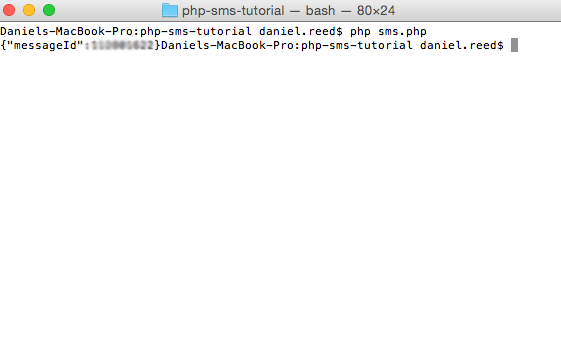

#Send SMS in PHP

Sending SMS from applications is more popular than ever, and this small script will enable you to send SMS in PHP. 

##Setup
1. Create a [Sinch developer account](https://www.sinch.com/signup)
2. In your developer dashboard, click “Apps” in the left menu
3. Click “Create new app”
4. Name your app and click “Create”
5. Plug your app key and secret into the script below       

```
<?php    
$key = "your_app_key";    
$secret = "your_app_secret"; 
$phone_number = "your_phone_number";
	 
$user = "application\\" . $key . ":" . $secret;    
$message = array("message"=>"Test");    
$data = json_encode($message);    
$ch = curl_init('https://messagingapi.sinch.com/v1/sms/' . $phone_number);    
curl_setopt($ch, CURLOPT_POST, true);    
curl_setopt($ch, CURLOPT_USERPWD,$user);    
curl_setopt($ch, CURLOPT_POSTFIELDS, $data);    
curl_setopt($ch, CURLOPT_RETURNTRANSFER, true);    
curl_setopt($ch, CURLOPT_SSL_VERIFYPEER, false);    
curl_setopt($ch, CURLOPT_HTTPHEADER, array('Content-Type: application/json'));    
	
$result = curl_exec($ch);    
	
if(curl_errno($ch)) {    
    echo 'Curl error: ' . curl_error($ch);    
} else {    
    echo $result;    
}   
	 
curl_close($ch);    
	
?> 
```

##Run it
Once you've put your app key and secret into the above script, run it from the command line using:

	php name_of_script_file.php
	


##Note about authentication
Please note that using basic authentication (as shown above) is only supported in Sinch sandbox applications. For production apps, we require that you sign your requests. To sign your requests in PHP, take a look at [this tutorial](https://www.sinch.com/tutorials/authentication-php-sinch-javascript-sdk/). 
